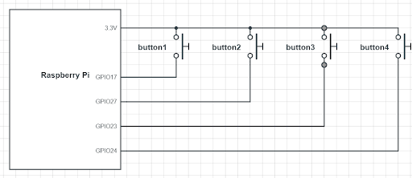
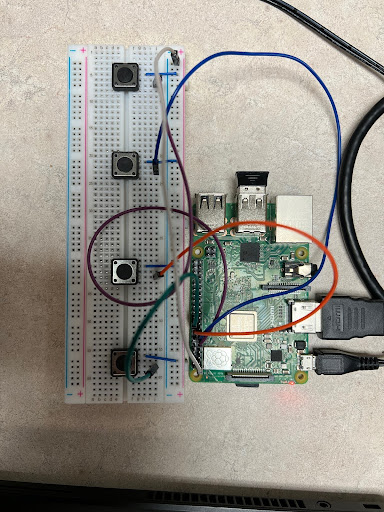
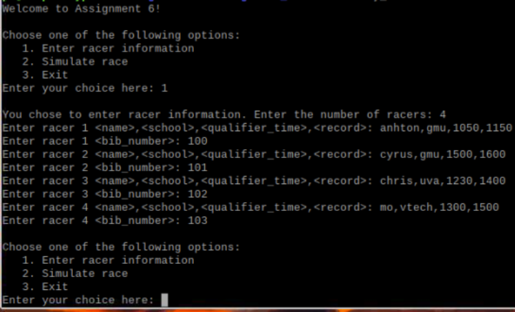
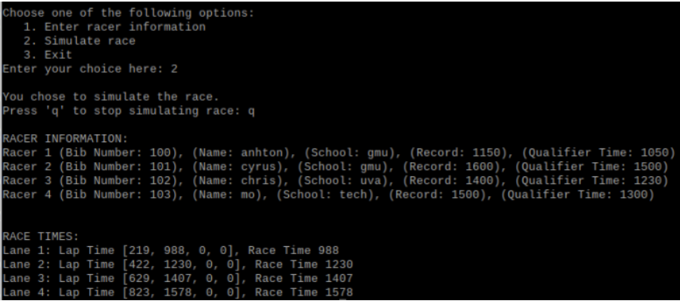
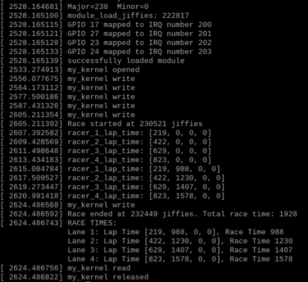

## Race Simulator

This application simulates a race using buttons to indicate when racers cross the finish line.

## Run Instructions

1. Obtain a Raspberry Pi (RPI)
2. Wire the RPI to the following schematic:




3. Build code:
```bash
cd src
make
```
4. Insert kernel module:
```bash
insmod my_kernel.ko
```
5. Run user-space app:
```bash
./my_user
```

## Expected Output

1. When starting the user-space app, you should be prompted to input in racer info.



2. You can now simulate the race by starting the race by entering `2` and stopping the race by entering `q`. During the simulation, any button clicks will be registered to an internal linked-list registered to each racer. This linked-list data is stored in kernel-space.



3. You can confirm that button clicks are registered to kernel-space by running `dmesg`.

